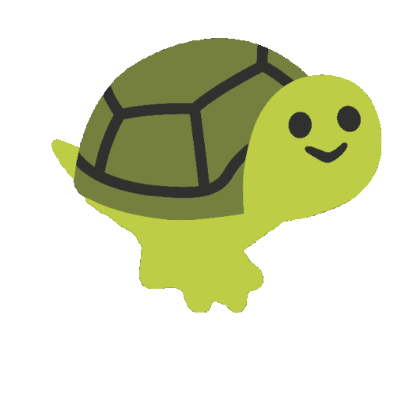
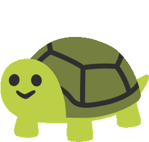
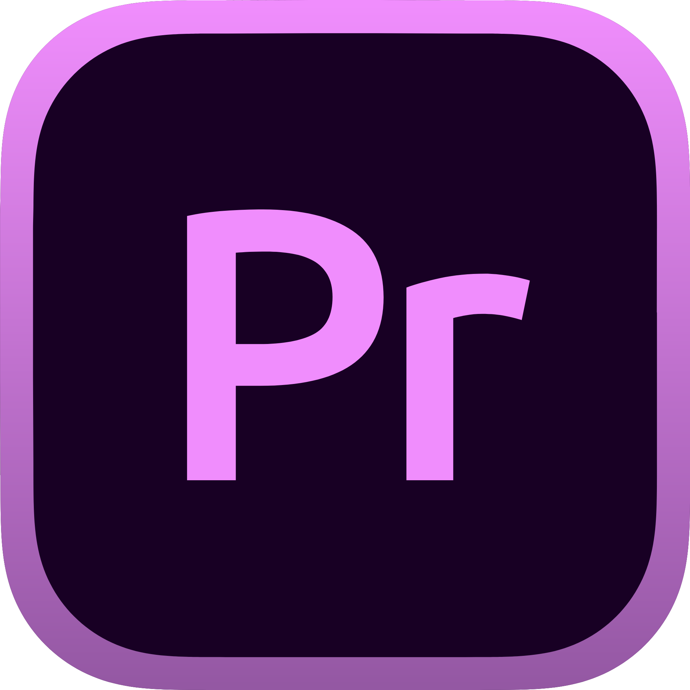
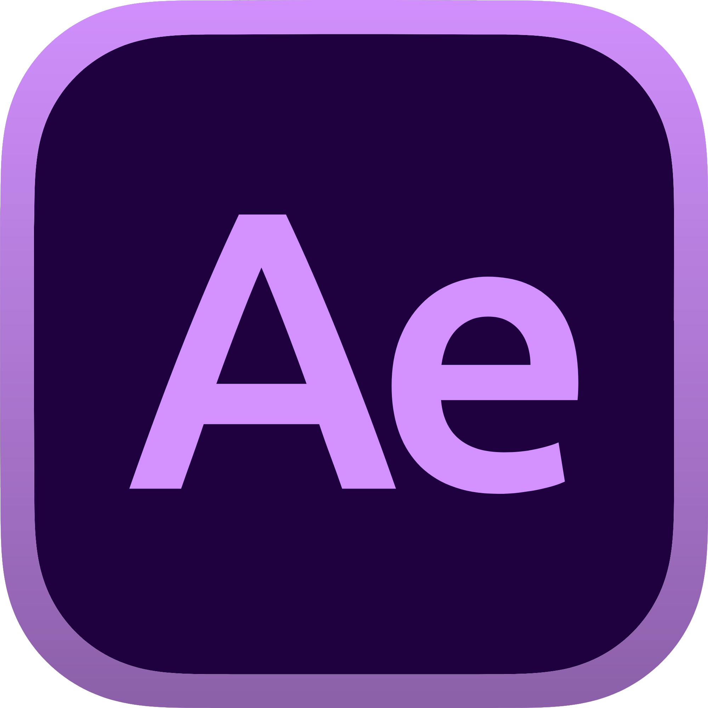
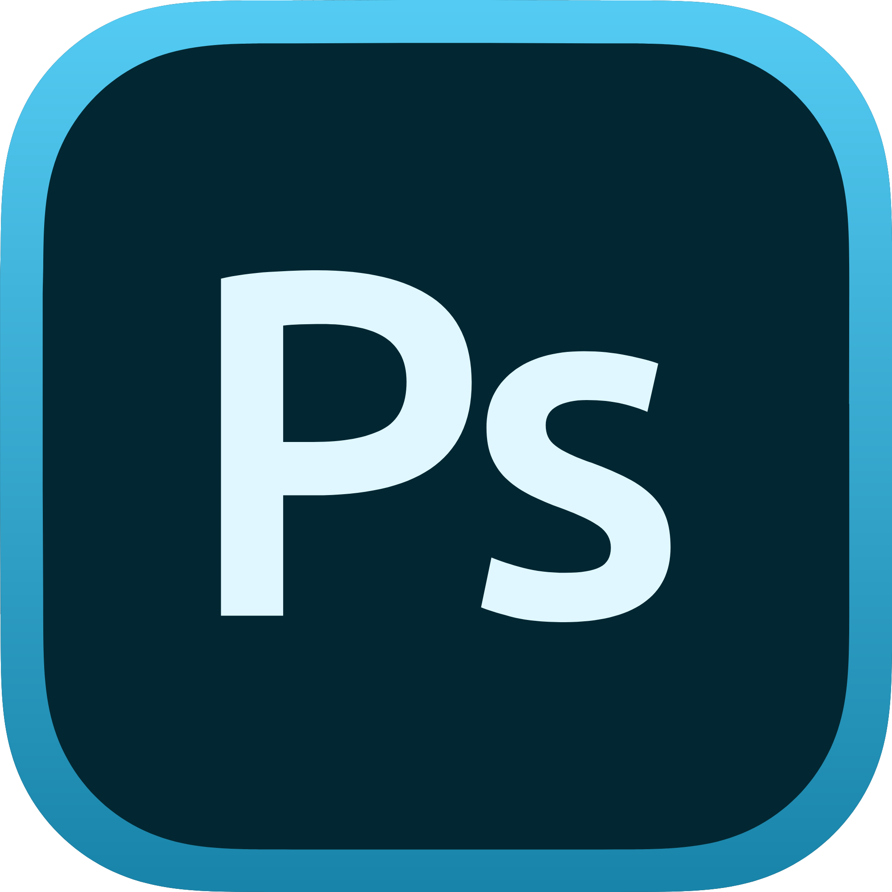

<h1 align="center">　Hi! 👾 I'm Snowaterice
    
        
    
</h1>
<h3 align="center">A Frontend Developer Intern from Taiwan🌈</h3>

    

<h2 align="left">
    
        
    
    About me
</h2>

* #### 🙍‍♂️ Student
* #### 🎮 Game Player
* #### 👻 Yeap! That's all

<h2 align="left">📢 Doing</h2>

* #### 🎨 Design and make my website
* #### 🤖 Make a discord robot
* #### 👓 Try to use some cool JS libraries and frameworks
* #### 🚌 Develop an useful website or app with TDX API service

<h2 align="left">📘 Learning</h2>

    
    
    
    
    
     
    
    
    
    

<h2 align="left">🔋 Skills</h2>

    
    
    
    

<h2 align="left">🏆 Stats</h2>

    
    
    

    
    

<h2 align="left">📫 Contact</h2>

    
    
    

    
